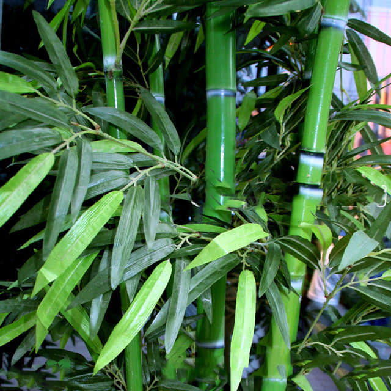

<h1 align='center'>Bamboo</h1>

    

## Info

 - **Origin**: China
 - **Production**: China
 - **Category**: Gramineae, Bambuseae
 - **Blooming**: Foliage plants, viewing period year around, the plant turns to yellow after flowering
 - **Color**: Flower color purple, leaf color green

## Maintenance

 - **Size**: Diameter ≥ 15 cm, height ≥ 30 cm
 - **Soil**: Soil with loose texture or soil with specific nutrients
 - **Sunlight**: Like sunshine, slightly resistant to half shade
 - **Watering**: Likes wet environments, water thoroughly when soil is dry, avoid saturated water
 - **Fertilization**: Dilute fertilizers following instructions, apply 1-2 times monthly
 - **Pruning**: Remove dead, rotten, diseased leaves and the parts that may affect the good appearance

## Parameter

| Name         | Min  | Max   |
|--------------|------|-------|
| Light (mmol) | 2700 | 7800  |
| Light (lux)  | 1000 | 60000 |
| Temp         | 5    | 32    |
| Humid        | 30   | 80    |
| Soil (moist) | 15   | 60    |
| Soil (ec)    | 100  | 1500  |