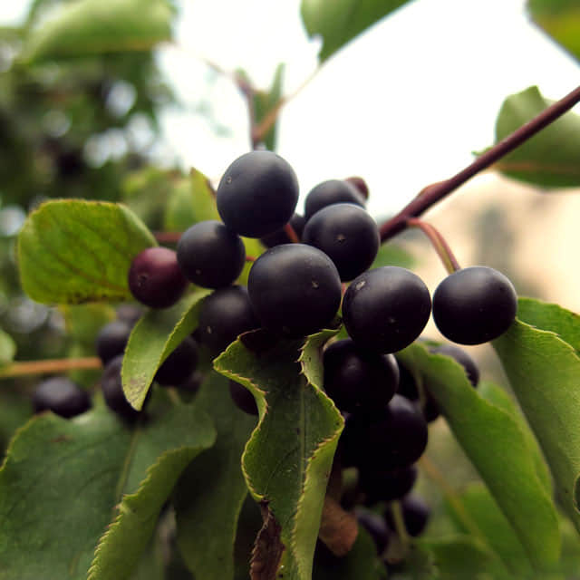

<h1 align='center'>Blackberry</h1>

    

## Info

 - **Origin**: North America
 - **Production**: China
 - **Category**: Rosaceae, Rubus
 - **Blooming**: Fruiting period June-August
 - **Color**: Flower color white, pink, fruit color black, redpurple

## Maintenance

 - **Size**: Diameter ≥ 10 cm, height ≥ 15 cm
 - **Soil**: Peat or soil with specific nutrients
 - **Sunlight**: Like sunshine, resistant to half shade, high quality fruits with adequate light
 - **Watering**: Likes wet environments, water thoroughly when soil is dry, avoid saturated water
 - **Fertilization**: Dilute fertilizers following instructions, apply 1-2 times monthly
 - **Pruning**: Remove aged tissues, dead, rotten, diseased leaves timely

## Parameter

| Name         | Min  | Max   |
|--------------|------|-------|
| Light (mmol) | 2500 | 4500  |
| Light (lux)  | 4000 | 30000 |
| Temp         | 5    | 35    |
| Humid        | 30   | 80    |
| Soil (moist) | 15   | 60    |
| Soil (ec)    | 350  | 2000  |