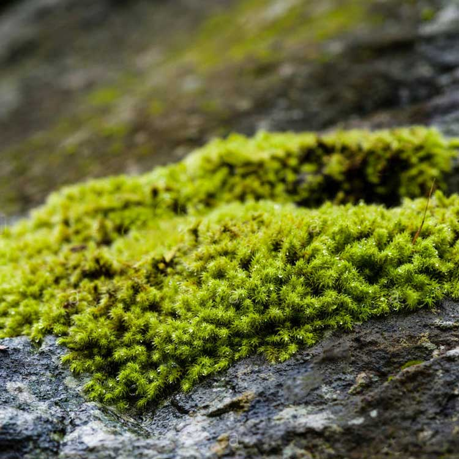

<h1 align='center'>Bryophyte</h1>

    

## Info

 - **Origin**: All over the world
 - **Production**: China
 - **Category**: Bryophyte plants
 - **Blooming**: Bryophyte, with simple structure, no flowering
 - **Color**: Leaf color tender green

## Maintenance

 - **Size**: Diameter 3-5cm，Height 3-10cm
 - **Soil**: Soil with loose texture and well drainage
 - **Sunlight**: Half shade, like bright scattered light
 - **Watering**: Like wet environment, spray water on leaves everyday
 - **Fertilization**: No need to fertilize
 - **Pruning**: Remove old, diseased and dead leaves timely

## Parameter

| Name         | Min  | Max   |
|--------------|------|-------|
| Light (mmol) | 500 | 4000  |
| Light (lux)  | 500 | 18000 |
| Temp         | 10    | 32    |
| Humid        | 40   | 95    |
| Soil (moist) | 25   | 75    |
| Soil (ec)    | 10  | 1000  |