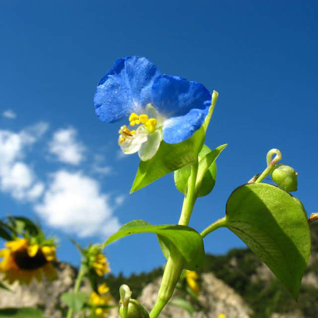

<h1 align='center'>Commelinaceae</h1>

    

## Info

 - **Origin**: Mexico
 - **Production**: China
 - **Category**: Commelinaceae, Commelina
 - **Blooming**: Flowering period May-September, fruiting period June-November
 - **Color**: Flower color blue, white

## Maintenance

 - **Size**: Diameter ≥ 10 cm, height ≥ 15 cm
 - **Soil**: Peat or soil with specific nutrients
 - **Sunlight**: Resistant to half shade, put in places with scattered light
 - **Watering**: Resistant to drought, water thoroughly after soil surface dries, avoid saturated water
 - **Fertilization**: Dilute fertilizers following instructions, apply 1-2 times monthly
 - **Pruning**: Remove aged tissues, dead, rotten, diseased leaves timely

## Parameter

| Name         | Min  | Max   |
|--------------|------|-------|
| Light (mmol) | 2000 | 3400  |
| Light (lux)  | 500 | 23000 |
| Temp         | 10    | 32    |
| Humid        | 30   | 80    |
| Soil (moist) | 15   | 60    |
| Soil (ec)    | 350  | 2000  |