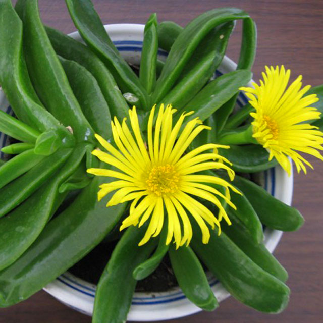

<h1 align='center'>Glottiphyllumuncatum</h1>

    

## Info

 - **Origin**: South Africa
 - **Production**: China
 - **Category**: Aizoaceae
 - **Blooming**: Flowering period September-December
 - **Color**: Flower color yellow

## Maintenance

 - **Size**: Diameter≥5cm，Height≥5cm
 - **Soil**: Loose fertile sandy loam
 - **Sunlight**: Like mild sunlight, resistant to half shade
 - **Watering**: Resistant to water, water thoroughly when soil surface is dry, avoid saturated water
 - **Fertilization**: Dilute fertilizers following instructions, apply once monthly in spring and autumn
 - **Pruning**: Remove flower stem, diseased and rotten leaves timely

## Parameter

| Name         | Min  | Max   |
|--------------|------|-------|
| Light (mmol) | 2000 | 5000  |
| Light (lux)  | 2000 | 40000 |
| Temp         | 10    | 35    |
| Humid        | 15   | 80    |
| Soil (moist) | 7   | 50    |
| Soil (ec)    | 300  | 1000  |