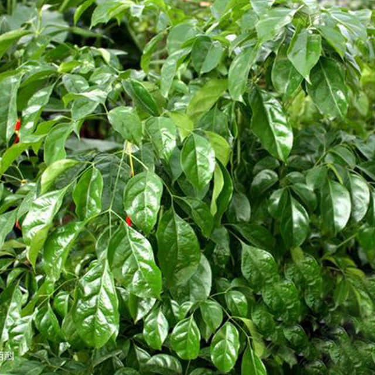

<h1 align='center'>Radermachera</h1>

    

## Info

 - **Origin**: Southeast Asia
 - **Production**: Southern China
 - **Category**: Bignoniaceae, Radermachera
 - **Blooming**: Foliage plants, rarely flowers
 - **Color**: Leaf color green

## Maintenance

 - **Size**: Diameter ≥ 15 cm, height ≥ 25 cm
 - **Soil**: Peat or soil with specific nutrients
 - **Sunlight**: Likes half shade, may take 2-3h moderate sunlight
 - **Watering**: Likes wet environments, water thoroughly when soil is dry, avoid saturated water
 - **Fertilization**: Dilute fertilizers following instructions, apply 1-2 times monthly
 - **Pruning**: Remove aged tissues, dead and pest branches timely

## Parameter

| Name         | Min  | Max   |
|--------------|------|-------|
| Light (mmol) | 1200 | 2000  |
| Light (lux)  | 600 | 18000 |
| Temp         | 5    | 32    |
| Humid        | 30   | 80    |
| Soil (moist) | 15   | 60    |
| Soil (ec)    | 350  | 2000  |