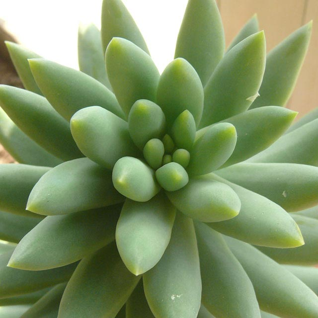

<h1 align='center'>Sedum</h1>

    

## Info

 - **Origin**: Africa
 - **Production**: China
 - **Category**: Crassulaceae, Sedum
 - **Blooming**: Succulent plants, sometimes flowers, rose red flowers
 - **Color**: Leaf color light green, when sunny leaf color turning to pink

## Maintenance

 - **Size**: Diameter 3-10 cm, height 5-15 cm
 - **Soil**: Peat and akadama mixed in 3:1 ratio
 - **Sunlight**: Like sunshine, short period of dormancy in summer and winter, use half shade for better care
 - **Watering**: Resistant to drought, water thoroughly when soil is dry, reduce water in dormancy
 - **Fertilization**: Dilute fertilizers following instructions,  apply once monthly in spring and autumn, except in dormancy
 - **Pruning**: Remove dead and rotten part timely

## Parameter

| Name         | Min  | Max   |
|--------------|------|-------|
| Light (mmol) | 3600 | 8000  |
| Light (lux)  | 3000 | 75000 |
| Temp         | 5    | 35    |
| Humid        | 15   | 80    |
| Soil (moist) | 7   | 50    |
| Soil (ec)    | 300  | 1000  |