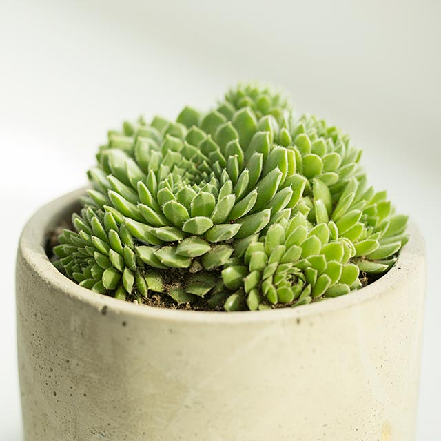

<h1 align='center'>Sempervivum</h1>

    

## Info

 - **Origin**: Holland
 - **Production**: Yunnan
 - **Category**: Crassulaceae, Sempervivum
 - **Blooming**: Succulent plants, blooms sometimes, when the plant sprouts a stem from the center, blooms with pink flowers
 - **Color**: Leaf color yellow green, gray green, dark green, brown

## Maintenance

 - **Size**: Diameter ≥ 10 cm, height 3-7 cm
 - **Soil**: Peat and akadama mixed in 3:1 ratio
 - **Sunlight**: Summer is its dormant period, use half shade for better care, spring and autumn are its growing seasons, need plenty of sunshine
 - **Watering**: Water thoroughly 2 times during summer dormancy, keep soil moist in other time, water thoroughly when soil is dry
 - **Fertilization**: Dilute fertilizers following instructions, apply once monthly
 - **Pruning**: Remove dead and rotten part timely

## Parameter

| Name         | Min  | Max   |
|--------------|------|-------|
| Light (mmol) | 4000 | 10000  |
| Light (lux)  | 4000 | 90000 |
| Temp         | 6    | 35    |
| Humid        | 15   | 80    |
| Soil (moist) | 7   | 50    |
| Soil (ec)    | 300  | 1000  |