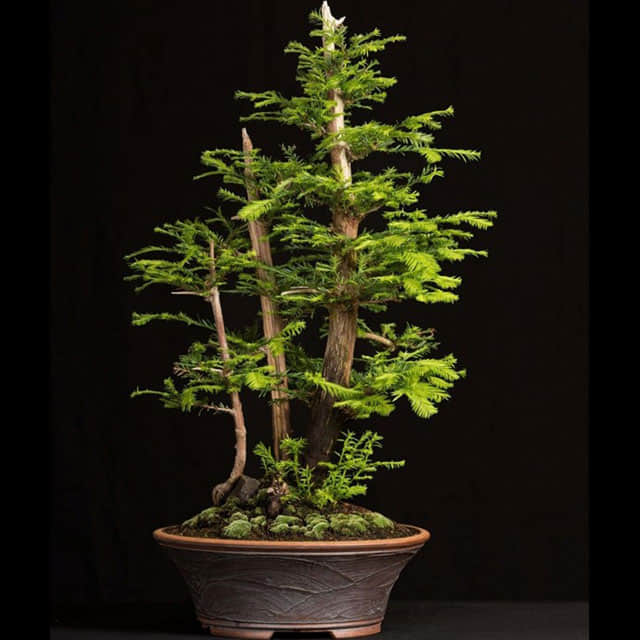

<h1 align='center'>Sequoioideae</h1>

    

## Info

 - **Origin**: United States, China
 - **Production**: Southwestern China
 - **Category**: Pinaceae, Larix
 - **Blooming**: Flowering period April-May, fruiting period October
 - **Color**: Flower color red, purple red, fruit color red, purple red, purple brown, lignht gray brown

## Maintenance

 - **Size**: Diameter ≥ 15 cm, height ≥ 30 cm
 - **Soil**: Peat or soil with specific nutrients
 - **Sunlight**: Like sunshine, slight shade tolerance
 - **Watering**: Water thoroughly when soil is dry, avoid saturated water
 - **Fertilization**: Dilute fertilizers following instructions, apply 1-2 times monthly
 - **Pruning**: Remove dead, rotten, diseased leaves and the parts that may affect the good appearance

## Parameter

| Name         | Min  | Max   |
|--------------|------|-------|
| Light (mmol) | 3500 | 5000  |
| Light (lux)  | 3500 | 50000 |
| Temp         | 5    | 35    |
| Humid        | 30   | 80    |
| Soil (moist) | 15   | 60    |
| Soil (ec)    | 350  | 2000  |