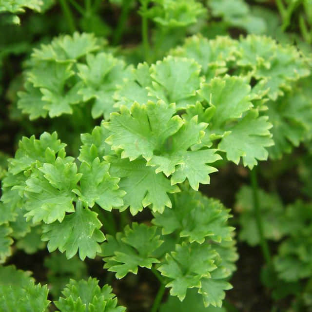

<h1 align='center'>Thymus</h1>

    

## Info

 - **Origin**: Mediterranean coastal areas
 - **Production**: China
 - **Category**: Labiatae, Teucrium
 - **Blooming**: Vanilla plants, flowering period July-August
 - **Color**: Flower color white

## Maintenance

 - **Size**: Diameter ≥ 10 cm, height 15-18 cm
 - **Soil**: Sandy loam
 - **Sunlight**: Put in sunny places
 - **Watering**: Keep soil moist
 - **Fertilization**: Apply organic fertilizers mainly, chemical fertilizer if needed
 - **Pruning**: Pruning branches and leaves slightly when plants over grown

## Parameter

| Name         | Min  | Max   |
|--------------|------|-------|
| Light (mmol) | 4000 | 6000  |
| Light (lux)  | 3700 | 60000 |
| Temp         | 5    | 35    |
| Humid        | 30   | 80    |
| Soil (moist) | 15   | 60    |
| Soil (ec)    | 350  | 2000  |